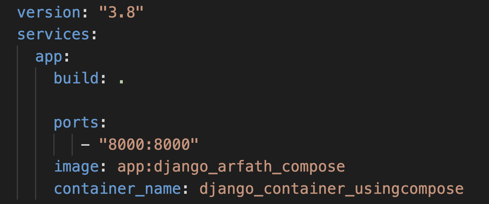

# Containerized Cluboard 
This is <b>Mohammed Arfath<b> student of NITK 2nd year  .
	
This is my final submission for the task of containerization of cluboard app under Systems SIG recruitments	

<h2> Cluboard </h2>	
A Full-Stack Web Application to facilitate sharing resources in college clubs. Clubs have resources that any of their members can borrow upon request. Members can borrow resources when approved by the convener of the club.
	
	

This Application is Containerized using [<b>DOCKER<b>](https://www.docker.com/)


	
 

<h2> Table of Contents </h2>

1. Installation Guide
2. Create Container
3. Create Super user
4. Dockerfile Explanation
5. DockerCompose Explanation
<br>


<h2>Installation Guide</h2>

<h3> Using Git and Github </h3>

- [Fork](https://docs.github.com/en/get-started/quickstart/fork-a-repo) the repo
- [Clone](https://docs.github.com/en/get-started/quickstart/contributing-to-projects#cloning-a-fork) the forked repository


<h3>Install required packages:</h3>

- Download Docker desktop [here](https://www.docker.com/) 
	
<h3>To create container:</h3>

- Enter into the  main folder (i.e app ) of the project and run the below commands
	To  Create image and start container in detached mode
``` shell 
docker-compose up -d 
```
- A container has now been created and is running in background 	
	

 
	
	
- Visit development server at http://127.0.0.1:8000

<h3>Create Super user:</h3>
     While the container is running in  detached mode
	
 - Enter into interactive mode 
 
``` shell 
docker exec -it django_container_usingcompose /bin/bash
```

 - Create superuser in cmd prompt.  `python manage.py createsuperuser`
 - Enter desired credentials
 - You can  now do development 	


<h3>Admin Site:</h3>

http://127.0.0.1:8000/admin

<br>
	
<h3>Dockerfile Explanation</h3>
	

	
- Used `python:3.9.0-slim-buster ` as the base image  since its light weight linux and contains python 3.9 
- `app`  Making it a main root directory fo my project where all file will be stored 
- installing all  dependencies using pip3 install `-r requirements.txt`	
- The RUN command  executes command on the image and to create layers 
- `CMD [ "python3","manage.py","runserver", "0.0.0.0:8000"]` 8000 port is assigned to the application server after starting it
<br>	
	
<h3>DockerCompose Explanation</h3>
	 
	
- building the docker image from docker file using the build . command 
- establishing connectiong between local host 8000 port and  container 8000
- tag of image = django_arfath_compose
- Naming the container as django_container_usingcompose
